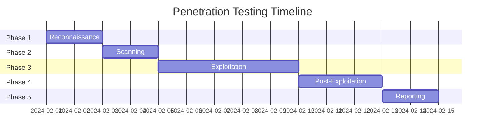

# Lucky Gas V3 Security Remediation Templates

## Overview

This document provides standardized templates for security remediation processes, including vulnerability reporting, prioritization, and penetration testing scope definition.

## 📋 Vulnerability Report Template

### Executive Summary

**Report ID**: VULN-[YYYY-MM-DD]-[NUMBER]  
**Date**: [Date]  
**Reported By**: [Name/Team]  
**Severity**: Critical | High | Medium | Low  
**Status**: New | In Progress | Resolved | Accepted Risk

**Summary**: [One paragraph executive summary of the vulnerability and its business impact]

### Vulnerability Details

#### Description
[Detailed description of the vulnerability, including technical details]

#### Affected Components
- **Systems**: [List affected systems/services]
- **Versions**: [Specific versions affected]
- **Endpoints**: [Affected API endpoints or URLs]
- **Data**: [Types of data at risk]

#### Discovery Method
- [ ] Automated Security Scan
- [ ] Penetration Testing
- [ ] Code Review
- [ ] Bug Bounty
- [ ] Incident Investigation
- [ ] Other: [Specify]

### Technical Analysis

#### Root Cause
[Detailed explanation of why this vulnerability exists]

#### Attack Vector
```
Attack Surface: [External/Internal/Physical]
Authentication: [Required/Not Required]
User Interaction: [Required/Not Required]
Privileges Required: [None/Low/High]
```

#### Proof of Concept
```bash
# Reproduction steps
1. [Step 1]
2. [Step 2]
3. [Step 3]

# Example exploit code (sanitized)
[Code snippet demonstrating the vulnerability]
```

#### Evidence
- **Screenshots**: [Links to screenshots]
- **Logs**: [Relevant log entries]
- **Network Capture**: [Packet capture details]

### Impact Assessment

#### Business Impact
- **Confidentiality**: [None/Low/High] - [Explanation]
- **Integrity**: [None/Low/High] - [Explanation]
- **Availability**: [None/Low/High] - [Explanation]
- **Financial**: [Estimated financial impact]
- **Reputation**: [Potential reputation damage]
- **Compliance**: [Regulatory implications]

#### Technical Impact
- **Data Exposure**: [Types and volume of data at risk]
- **System Access**: [Level of system access possible]
- **Lateral Movement**: [Potential for spreading]
- **Persistence**: [Ability to maintain access]

### CVSS Scoring

```
CVSS Version: 3.1
Base Score: [0.0-10.0]
Vector String: CVSS:3.1/AV:[N/A/L/P]/AC:[L/H]/PR:[N/L/H]/UI:[N/R]/S:[U/C]/C:[N/L/H]/I:[N/L/H]/A:[N/L/H]

Temporal Score: [0.0-10.0]
Environmental Score: [0.0-10.0]
```

### Remediation Plan

#### Immediate Actions
1. [Immediate mitigation step 1]
2. [Immediate mitigation step 2]
3. [Temporary workaround if available]

#### Long-term Fix
1. **Code Changes**:
   ```diff
   - [Vulnerable code]
   + [Fixed code]
   ```

2. **Configuration Changes**:
   ```yaml
   # Secure configuration
   [Configuration details]
   ```

3. **Infrastructure Changes**:
   - [Required infrastructure updates]

#### Validation Steps
1. [How to verify the fix is effective]
2. [Test cases to run]
3. [Security scan to perform]

### Timeline

| Milestone | Target Date | Owner | Status |
|-----------|------------|-------|--------|
| Discovery | [Date] | [Name] | Complete |
| Triage | [Date] | [Name] | [Status] |
| Fix Development | [Date] | [Name] | [Status] |
| Testing | [Date] | [Name] | [Status] |
| Deployment | [Date] | [Name] | [Status] |
| Verification | [Date] | [Name] | [Status] |

### References
- **CVE ID**: [If applicable]
- **CWE ID**: [Weakness classification]
- **OWASP**: [Related OWASP category]
- **Internal Ticket**: [Ticket number]
- **Related Reports**: [Links to related vulnerabilities]

---

## 🎯 Security Fix Priority Matrix

### Priority Calculation

The priority score is calculated using the following formula:
```
Priority Score = (CVSS Base Score × 10) + (Exploitability × 20) + (Business Impact × 30) + (Exposure × 20) + (Fix Complexity × -20)
```

### Priority Matrix

| Criteria | Weight | Score Guidelines |
|----------|--------|------------------|
| **CVSS Score** | 10% | 0-3.9 = Low (1), 4.0-6.9 = Medium (2), 7.0-8.9 = High (3), 9.0-10.0 = Critical (4) |
| **Exploitability** | 20% | Not Exploitable (0), Difficult (1), Moderate (2), Easy (3), Automated (4) |
| **Business Impact** | 30% | Minimal (1), Low (2), Medium (3), High (4), Critical (5) |
| **Exposure** | 20% | Internal Only (1), Partners (2), Authenticated Users (3), Internet (4) |
| **Fix Complexity** | -20% | Trivial (1), Simple (2), Moderate (3), Complex (4), Architectural (5) |

### Priority Levels

| Priority Score | Level | Response Time | Description |
|----------------|-------|---------------|-------------|
| 90-100 | P0 - Emergency | 4 hours | Drop everything, all hands on deck |
| 70-89 | P1 - Critical | 24 hours | Immediate action required |
| 50-69 | P2 - High | 7 days | Schedule for current sprint |
| 30-49 | P3 - Medium | 30 days | Schedule for next release |
| 0-29 | P4 - Low | 90 days | Backlog for future consideration |

### Sample Priority Calculation

```yaml
Vulnerability: SQL Injection in Login Form
CVSS Score: 8.5 (High) = 3 points × 10% = 3
Exploitability: Easy (3) × 20% = 12
Business Impact: Critical (5) × 30% = 30  
Exposure: Internet (4) × 20% = 16
Fix Complexity: Simple (2) × -20% = -8

Total Priority Score: 3 + 12 + 30 + 16 - 8 = 85 (P1 - Critical)
```

### Priority Assignment Template

```markdown
## Vulnerability Priority Assignment

**Vulnerability**: [Name]
**Report ID**: [ID]

### Scoring
- CVSS Base Score: [Score] ([Level]) = [Points]
- Exploitability: [Level] ([Score]) × 20% = [Points]
- Business Impact: [Level] ([Score]) × 30% = [Points]
- Exposure: [Level] ([Score]) × 20% = [Points]
- Fix Complexity: [Level] ([Score]) × -20% = [Points]

**Total Priority Score**: [Total] = **[Priority Level]**

### Justification
[Explain any special circumstances or overrides]

### Assignment
- **Team**: [Assigned team]
- **Owner**: [Primary contact]
- **Due Date**: [Based on priority level]
```

---

## 🔍 Penetration Test Scope Document

### Project Overview

**Project Name**: Lucky Gas V3 Security Assessment  
**Test Period**: [Start Date] to [End Date]  
**Testing Team**: [Internal/External Vendor Name]  
**Primary Contact**: [Name, Email, Phone]

### Objectives

#### Primary Objectives
1. Identify security vulnerabilities in the Lucky Gas application
2. Validate security controls effectiveness
3. Test incident response procedures
4. Verify compliance with security standards
5. Assess overall security posture

#### Specific Focus Areas
- [ ] Authentication and session management
- [ ] API security and input validation
- [ ] Data protection and encryption
- [ ] Business logic vulnerabilities
- [ ] Infrastructure security
- [ ] Mobile application security

### Scope Definition

#### In-Scope Systems

##### Production Environment
```yaml
Web Applications:
  - URL: https://app.luckygas.com.tw
  - URL: https://api.luckygas.com.tw
  - URL: https://admin.luckygas.com.tw

Mobile Applications:
  - iOS: com.luckygas.delivery
  - Android: com.luckygas.delivery

API Endpoints:
  - REST API: /api/v1/*
  - GraphQL: /graphql
  - WebSocket: wss://ws.luckygas.com.tw

Infrastructure:
  - GCP Project: luckygas-prod
  - Load Balancers: [List]
  - CDN: [Provider and endpoints]
```

##### IP Ranges
```
External IPs:
  - 203.0.113.0/24 (Example)
  - 198.51.100.0/24 (Example)

Internal Networks:
  - 10.0.0.0/16 (GCP VPC)
  - 172.16.0.0/12 (Container networks)
```

#### Out-of-Scope Systems
- Development environments
- Employee workstations
- Office network infrastructure
- Third-party services (unless specifically included)
- Physical security testing

### Testing Methodology

#### Testing Types

##### Black Box Testing
- No credentials provided
- External attacker perspective
- Public information only

##### Gray Box Testing
- Limited credentials provided
- Basic user accounts
- API documentation access

##### White Box Testing
- Full access to source code
- Architecture documentation
- Administrative credentials

#### Testing Phases



### Rules of Engagement

#### Authorized Activities
- [ ] Vulnerability scanning
- [ ] Manual security testing
- [ ] Password attacks (with restrictions)
- [ ] Social engineering (if approved)
- [ ] Physical security (if approved)

#### Prohibited Activities
- [ ] Denial of Service attacks
- [ ] Data destruction or modification
- [ ] Accessing customer production data
- [ ] Testing outside business hours (unless approved)
- [ ] Attacks on out-of-scope systems

#### Special Restrictions
- Rate limiting: Max 100 requests/minute
- Scan timing: Business hours only
- Data handling: No customer data extraction
- Account creation: Limited to 10 test accounts

### Communication Plan

#### Escalation Matrix

| Severity | Description | Contact Method | Response Time |
|----------|-------------|----------------|---------------|
| Critical | Active compromise detected | Phone + Email | Immediate |
| High | Exploitable vulnerability found | Email + Slack | 1 hour |
| Medium | Significant finding | Email | 4 hours |
| Low | Minor issues | Weekly report | Weekly |

#### Regular Communications
- Daily status updates via email
- Weekly progress meetings
- Emergency hotline: +886-2-XXXX-XXXX

### Legal and Compliance

#### Authorization
```
I, [Name], [Title] of Lucky Gas Co., Ltd., hereby authorize [Testing Company] 
to perform security testing on the systems listed in this scope document
during the period of [Start Date] to [End Date].

Signature: _____________________ Date: _____________
```

#### Compliance Requirements
- [ ] Personal Data Protection Act (Taiwan)
- [ ] PCI DSS (if processing payments)
- [ ] ISO 27001 alignment
- [ ] Industry-specific regulations

#### Liability and Insurance
- Professional liability insurance required
- Indemnification clauses
- Data breach insurance coverage

### Deliverables

#### Reports
1. **Executive Summary** - High-level findings and recommendations
2. **Technical Report** - Detailed vulnerabilities and evidence
3. **Remediation Guide** - Step-by-step fix instructions
4. **Retest Report** - Validation of fixes

#### Timeline
- Initial findings: Within 24 hours of discovery
- Draft report: 5 business days after testing
- Final report: 10 business days after testing
- Retest report: 5 business days after retest

### Success Criteria

#### Metrics
- 100% of in-scope systems tested
- All critical/high vulnerabilities identified
- Zero false positives in final report
- Remediation validated through retest

#### Quality Assurance
- Peer review of all findings
- Automated scan validation
- Evidence collection for all findings
- Reproducible proof-of-concept

### Post-Test Activities

#### Knowledge Transfer
- Technical debrief session
- Remediation workshop
- Security awareness training

#### Follow-up
- 30-day remediation check
- 90-day security posture review
- Annual retest recommendation

---

## 📊 Vulnerability Tracking Dashboard

### Dashboard Template

```markdown
# Security Vulnerability Dashboard

**Last Updated**: [Date]  
**Total Vulnerabilities**: [Number]

## Summary by Severity
- 🔴 Critical: [Number] ([Percentage]%)
- 🟠 High: [Number] ([Percentage]%)
- 🟡 Medium: [Number] ([Percentage]%)
- 🟢 Low: [Number] ([Percentage]%)

## Summary by Status
- 📋 New: [Number]
- 🔄 In Progress: [Number]
- ✅ Resolved: [Number]
- ⚠️ Accepted Risk: [Number]

## Aging Report
- Overdue (>SLA): [Number]
- Due This Week: [Number]
- Due This Month: [Number]

## Top Vulnerabilities
1. [VULN-ID] - [Title] - [Severity] - [Days Open]
2. [VULN-ID] - [Title] - [Severity] - [Days Open]
3. [VULN-ID] - [Title] - [Severity] - [Days Open]

## Remediation Metrics
- Average Time to Fix: [Days]
- Fix Rate: [Percentage]%
- Reopen Rate: [Percentage]%
```

---

**Document Version**: 1.0  
**Last Updated**: 2024-01-30  
**Next Review**: 2024-03-01  
**Owner**: Security Team  
**Classification**: Confidential