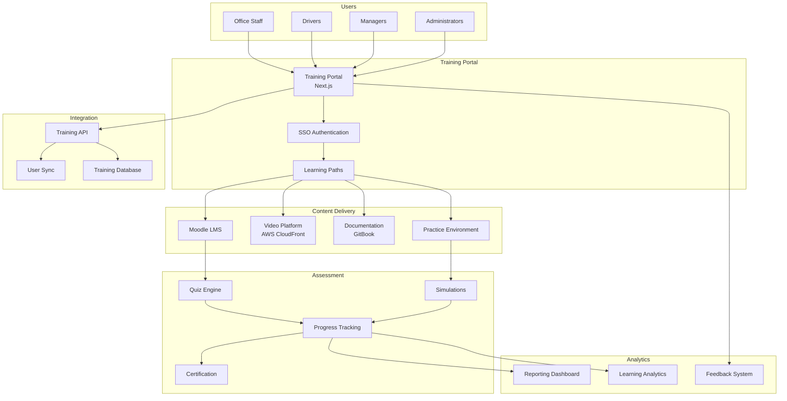
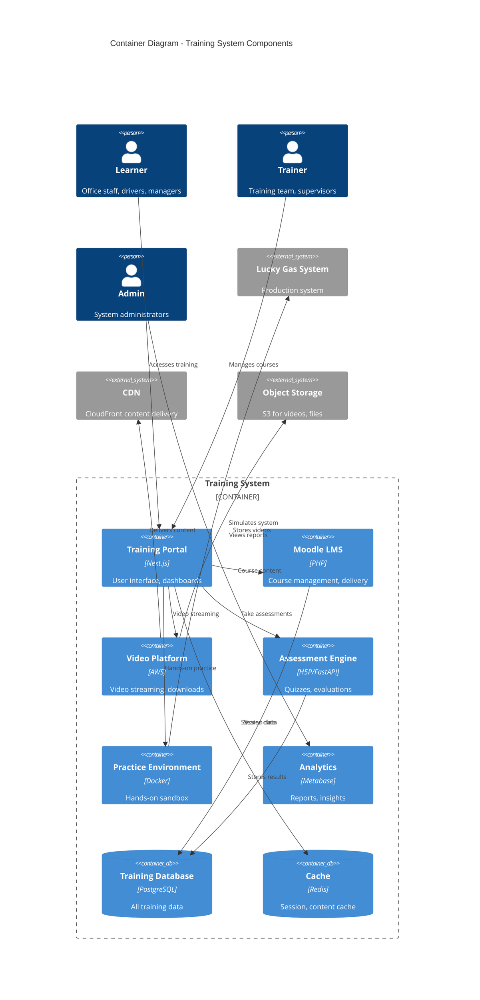
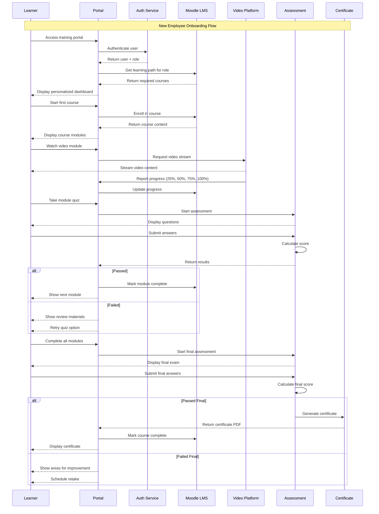
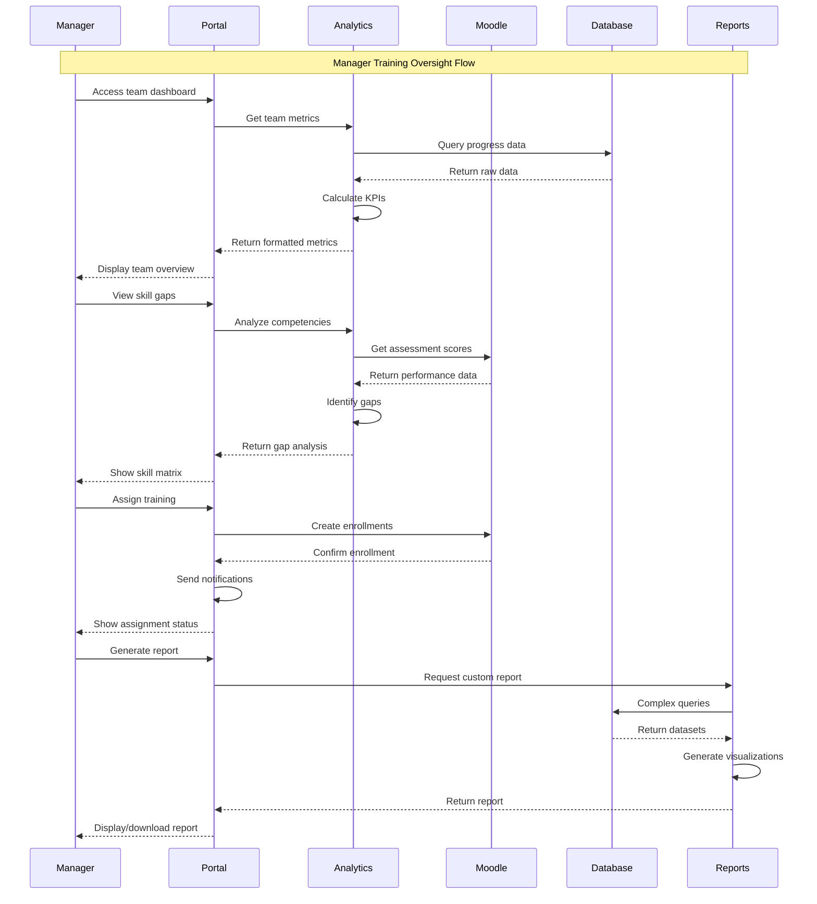

# Lucky Gas Training Architecture Document

## Introduction

This document outlines the overall training architecture for Lucky Gas Delivery Management System, including learning management systems, content delivery platforms, assessment methodologies, and training infrastructure. Its primary goal is to serve as the guiding blueprint for comprehensive user training and continuous learning programs.

**Relationship to System Architecture:**
This training architecture complements the main system architecture by ensuring users can effectively utilize all system features. It integrates with the production system for hands-on practice while maintaining a separate training environment for safe learning.

### Starter Template or Existing Project
**Decision**: Building custom training architecture integrated with Lucky Gas system, utilizing open-source LMS components and cloud-based video delivery platforms.

### Change Log
| Date | Version | Description | Author |
|------|---------|-------------|---------|
| 2025-01-20 | 1.0 | Initial training architecture design | BMad AI |
| 2025-01-21 | 1.1 | Added video platform integration | BMad AI |
| 2025-01-22 | 1.2 | Enhanced assessment framework | BMad AI |

## High Level Architecture

### Technical Summary
The Lucky Gas training architecture implements a hybrid learning management system combining Moodle LMS for course management, AWS CloudFront for video delivery, and custom integration with the production system for hands-on practice. The architecture supports multilingual content, role-based learning paths, and comprehensive assessment tracking. Core patterns include microlearning modules, just-in-time training delivery, and gamification elements to enhance engagement.

### High Level Overview
1. **Main Architectural Style**: Hybrid cloud-based learning ecosystem with on-premise components
2. **Repository Structure**: Integrated with main Lucky Gas monorepo for training materials
3. **Service Architecture**: Microservices for content delivery, assessment, and analytics
4. **Primary User Flow**: Role detection → Learning path assignment → Content delivery → Assessment → Certification
5. **Key Decisions**: 
   - Moodle for proven LMS capabilities
   - AWS for scalable video delivery
   - Custom integration for system-specific training

### High Level Project Diagram


### Architectural and Design Patterns
- **Microlearning Architecture:** Bite-sized learning modules (5-15 mins) - *Rationale:* Fits busy operational schedules and improves retention
- **Adaptive Learning Pattern:** AI-driven content recommendation - *Rationale:* Personalizes learning experience based on role and performance
- **Blended Learning Model:** Mix of self-paced, instructor-led, and hands-on - *Rationale:* Accommodates different learning styles and schedules
- **Competency-Based Progression:** Skills verification before advancement - *Rationale:* Ensures practical proficiency, not just theoretical knowledge
- **Mobile-First Design:** Responsive content for all devices - *Rationale:* Enables learning anywhere, especially for field staff

## Tech Stack

### Cloud Infrastructure
- **Provider:** AWS (primary), Google Cloud (video processing)
- **Key Services:** CloudFront CDN, S3 storage, Lambda functions, Elemental MediaConvert
- **Deployment Regions:** Asia-Pacific (Taiwan), with CDN edge locations

### Technology Stack Table
| Category | Technology | Version | Purpose | Rationale |
|----------|------------|---------|---------|-----------|
| **LMS Platform** | Moodle | 4.3 LTS | Learning management system | Open-source, highly customizable, SCORM compliant |
| **Frontend Framework** | Next.js | 14.0.4 | Training portal UI | Server-side rendering, excellent performance |
| **Video Platform** | AWS CloudFront | Latest | Video content delivery | Low latency, regional caching, HLS support |
| **Documentation** | GitBook | 2.0 | User documentation | Version control, search capability, markdown support |
| **Assessment Engine** | H5P | 1.24 | Interactive content | Rich content types, mobile-friendly, analytics |
| **Database** | PostgreSQL | 15.5 | Training data storage | Reliable, supports complex queries |
| **Cache** | Redis | 7.2 | Session and content cache | High performance, reduces database load |
| **Search** | Elasticsearch | 8.11 | Content search | Full-text search, multilingual support |
| **Analytics** | Metabase | 0.48 | Learning analytics | User-friendly dashboards, SQL support |
| **Video Processing** | FFmpeg | 6.0 | Video transcoding | Industry standard, multiple format support |
| **API Framework** | FastAPI | 0.109 | Training API | High performance, automatic documentation |
| **Authentication** | Keycloak | 23.0 | SSO integration | Enterprise SSO, LDAP support |
| **Monitoring** | Grafana | 10.2 | System monitoring | Real-time metrics, alerting |

## Data Models

### User Profile
**Purpose:** Extended user profile for training tracking

**Key Attributes:**
- user_id: UUID - Links to main system user
- role: String - Primary job role
- department: String - Organizational unit
- language_preference: String - zh-TW, en, etc.
- learning_style: Enum - Visual, auditory, kinesthetic
- skill_level: JSON - Current competency levels
- certifications: Array - Earned certificates
- training_history: Array - Completed courses

**Relationships:**
- One-to-one with system User model
- One-to-many with Course Enrollments
- One-to-many with Certificates

### Course
**Purpose:** Training course definition and metadata

**Key Attributes:**
- course_id: UUID - Unique identifier
- title: String - Course name (multilingual)
- description: Text - Course overview
- duration: Integer - Estimated minutes
- difficulty: Enum - Beginner, intermediate, advanced
- prerequisites: Array - Required courses
- objectives: Array - Learning objectives
- modules: Array - Course content structure

**Relationships:**
- Many-to-many with User (through Enrollment)
- One-to-many with Modules
- Many-to-many with Roles (target audience)

### Learning Path
**Purpose:** Role-specific training sequences

**Key Attributes:**
- path_id: UUID - Unique identifier
- role: String - Target role
- name: String - Path name
- description: Text - Path purpose
- courses: Array - Ordered course list
- milestones: Array - Progress checkpoints
- duration_estimate: Integer - Total hours
- mandatory: Boolean - Required for role

**Relationships:**
- One-to-many with Courses
- Many-to-many with Users
- One-to-many with Milestones

### Assessment
**Purpose:** Quiz and evaluation tracking

**Key Attributes:**
- assessment_id: UUID - Unique identifier
- type: Enum - Quiz, simulation, practical
- course_id: UUID - Related course
- questions: JSON - Question bank
- passing_score: Integer - Minimum percentage
- time_limit: Integer - Minutes allowed
- attempts_allowed: Integer - Maximum tries
- randomize: Boolean - Question order

**Relationships:**
- Many-to-one with Course
- One-to-many with Assessment Results
- Many-to-many with Questions

### Progress Tracking
**Purpose:** Detailed learning progress data

**Key Attributes:**
- tracking_id: UUID - Unique identifier
- user_id: UUID - Learner reference
- course_id: UUID - Course reference
- module_id: UUID - Current module
- progress_percentage: Float - Completion status
- time_spent: Integer - Minutes logged
- last_accessed: DateTime - Recent activity
- bookmarks: Array - Saved positions

**Relationships:**
- Many-to-one with User
- Many-to-one with Course
- Many-to-one with Module

## Components

### Training Portal
**Responsibility:** Main entry point for all training activities, role-based dashboard, learning path visualization

**Key Interfaces:**
- GET /api/training/dashboard - User training overview
- GET /api/training/paths/{role} - Role-specific paths
- POST /api/training/enroll - Course enrollment
- GET /api/training/certificates - Certificate management

**Dependencies:** Authentication service, LMS API, User service

**Technology Stack:** Next.js 14, TypeScript, Tailwind CSS, React Query

### Moodle LMS
**Responsibility:** Core learning management, course delivery, SCORM compliance, grade tracking

**Key Interfaces:**
- Moodle Web Services API
- SCORM 1.2/2004 player
- LTI 1.3 integration
- Grade passback service

**Dependencies:** PostgreSQL database, Redis cache, File storage

**Technology Stack:** PHP 8.2, Moodle 4.3, Custom plugins

### Video Delivery Platform
**Responsibility:** Streaming video content, adaptive bitrate, offline download, progress tracking

**Key Interfaces:**
- HLS/DASH streaming endpoints
- Video progress API
- Download management API
- Analytics collection

**Dependencies:** AWS CloudFront, S3 storage, Lambda functions

**Technology Stack:** CloudFront CDN, MediaConvert, Lambda@Edge

### Assessment Engine
**Responsibility:** Quiz delivery, simulation hosting, practical evaluations, result processing

**Key Interfaces:**
- POST /api/assessment/start - Begin assessment
- POST /api/assessment/submit - Submit answers
- GET /api/assessment/results - View results
- POST /api/assessment/certificate - Generate certificate

**Dependencies:** Question bank, Scoring service, Certificate generator

**Technology Stack:** H5P, FastAPI, PostgreSQL, PDF generation

### Practice Environment
**Responsibility:** Safe sandbox for hands-on practice, realistic data, reset capability

**Key Interfaces:**
- POST /api/practice/provision - Create practice instance
- POST /api/practice/reset - Reset to clean state
- GET /api/practice/scenarios - Available scenarios
- POST /api/practice/validate - Check exercise completion

**Dependencies:** Main system APIs, Test data generator, Container orchestration

**Technology Stack:** Docker, Kubernetes, Lucky Gas system clone

### Analytics Dashboard
**Responsibility:** Learning metrics, progress reporting, trend analysis, ROI measurement

**Key Interfaces:**
- Real-time progress dashboards
- Completion reports
- Skill gap analysis
- Training effectiveness metrics

**Dependencies:** Data warehouse, Progress tracking, Assessment results

**Technology Stack:** Metabase, PostgreSQL, Python data pipeline

### Component Diagrams


## External APIs

### Lucky Gas Production API
- **Purpose:** User authentication, role verification, system integration
- **Documentation:** https://api.luckygas.com.tw/docs
- **Base URL(s):** https://api.luckygas.com.tw/v1
- **Authentication:** OAuth 2.0 with training scope
- **Rate Limits:** 1000 requests/hour per user

**Key Endpoints Used:**
- `GET /users/{id}` - Fetch user details for training profile
- `GET /users/{id}/role` - Verify current role and permissions
- `POST /auth/token` - Generate training session token

**Integration Notes:** Read-only access to production data, separate training tenant

### AWS Services API
- **Purpose:** Video processing, delivery, storage management
- **Documentation:** https://docs.aws.amazon.com/
- **Base URL(s):** Regional endpoints
- **Authentication:** IAM roles with STS
- **Rate Limits:** Standard AWS limits apply

**Key Endpoints Used:**
- `POST /mediaconvert/jobs` - Transcode uploaded videos
- `PUT /s3/training-videos/*` - Upload video content
- `POST /cloudfront/invalidation` - Refresh CDN cache

**Integration Notes:** Use AWS SDK, implement exponential backoff

### Translation API
- **Purpose:** Multi-language content translation and subtitles
- **Documentation:** https://cloud.google.com/translate/docs
- **Base URL(s):** https://translation.googleapis.com/v2
- **Authentication:** API key with domain restriction
- **Rate Limits:** 500,000 characters/month

**Key Endpoints Used:**
- `POST /translate` - Translate course content
- `POST /detect` - Detect source language
- `GET /languages` - List supported languages

**Integration Notes:** Cache translations, implement fallback for offline

## Core Workflows





## REST API Spec

```yaml
openapi: 3.0.0
info:
  title: Lucky Gas Training API
  version: 1.0.0
  description: Training system API for Lucky Gas delivery management
servers:
  - url: https://training-api.luckygas.com.tw/v1
    description: Production training server
  - url: https://training-api-test.luckygas.com.tw/v1
    description: Test training server

security:
  - bearerAuth: []

paths:
  /training/dashboard:
    get:
      summary: Get user training dashboard
      tags: [Dashboard]
      responses:
        200:
          description: Dashboard data
          content:
            application/json:
              schema:
                type: object
                properties:
                  user:
                    $ref: '#/components/schemas/TrainingProfile'
                  enrollments:
                    type: array
                    items:
                      $ref: '#/components/schemas/Enrollment'
                  recommendations:
                    type: array
                    items:
                      $ref: '#/components/schemas/Course'
                  achievements:
                    type: array
                    items:
                      $ref: '#/components/schemas/Achievement'

  /training/paths/{role}:
    get:
      summary: Get learning paths for role
      tags: [Learning Paths]
      parameters:
        - name: role
          in: path
          required: true
          schema:
            type: string
            enum: [office_staff, driver, manager, admin]
      responses:
        200:
          description: Learning paths
          content:
            application/json:
              schema:
                type: array
                items:
                  $ref: '#/components/schemas/LearningPath'

  /training/courses:
    get:
      summary: List available courses
      tags: [Courses]
      parameters:
        - name: category
          in: query
          schema:
            type: string
        - name: difficulty
          in: query
          schema:
            type: string
            enum: [beginner, intermediate, advanced]
        - name: language
          in: query
          schema:
            type: string
            default: zh-TW
      responses:
        200:
          description: Course list
          content:
            application/json:
              schema:
                type: object
                properties:
                  courses:
                    type: array
                    items:
                      $ref: '#/components/schemas/Course'
                  total:
                    type: integer
                  page:
                    type: integer

  /training/enroll:
    post:
      summary: Enroll in a course
      tags: [Enrollment]
      requestBody:
        required: true
        content:
          application/json:
            schema:
              type: object
              properties:
                course_id:
                  type: string
                  format: uuid
                schedule_preference:
                  type: string
                  enum: [immediate, scheduled]
                scheduled_date:
                  type: string
                  format: date-time
      responses:
        201:
          description: Enrollment created
          content:
            application/json:
              schema:
                $ref: '#/components/schemas/Enrollment'

  /training/progress/{course_id}:
    get:
      summary: Get course progress
      tags: [Progress]
      parameters:
        - name: course_id
          in: path
          required: true
          schema:
            type: string
            format: uuid
      responses:
        200:
          description: Progress details
          content:
            application/json:
              schema:
                $ref: '#/components/schemas/Progress'

    post:
      summary: Update course progress
      tags: [Progress]
      parameters:
        - name: course_id
          in: path
          required: true
          schema:
            type: string
            format: uuid
      requestBody:
        required: true
        content:
          application/json:
            schema:
              type: object
              properties:
                module_id:
                  type: string
                  format: uuid
                progress_percentage:
                  type: number
                  minimum: 0
                  maximum: 100
                time_spent:
                  type: integer
                  description: Minutes
      responses:
        200:
          description: Progress updated

  /assessments/start:
    post:
      summary: Start an assessment
      tags: [Assessment]
      requestBody:
        required: true
        content:
          application/json:
            schema:
              type: object
              properties:
                assessment_id:
                  type: string
                  format: uuid
                course_id:
                  type: string
                  format: uuid
      responses:
        200:
          description: Assessment session
          content:
            application/json:
              schema:
                $ref: '#/components/schemas/AssessmentSession'

  /assessments/submit:
    post:
      summary: Submit assessment answers
      tags: [Assessment]
      requestBody:
        required: true
        content:
          application/json:
            schema:
              type: object
              properties:
                session_id:
                  type: string
                  format: uuid
                answers:
                  type: array
                  items:
                    type: object
                    properties:
                      question_id:
                        type: string
                      answer:
                        type: string
                time_taken:
                  type: integer
                  description: Seconds
      responses:
        200:
          description: Assessment results
          content:
            application/json:
              schema:
                $ref: '#/components/schemas/AssessmentResult'

  /certificates:
    get:
      summary: List user certificates
      tags: [Certificates]
      responses:
        200:
          description: Certificate list
          content:
            application/json:
              schema:
                type: array
                items:
                  $ref: '#/components/schemas/Certificate'

  /certificates/{certificate_id}/download:
    get:
      summary: Download certificate PDF
      tags: [Certificates]
      parameters:
        - name: certificate_id
          in: path
          required: true
          schema:
            type: string
            format: uuid
      responses:
        200:
          description: Certificate PDF
          content:
            application/pdf:
              schema:
                type: string
                format: binary

components:
  securitySchemes:
    bearerAuth:
      type: http
      scheme: bearer
      bearerFormat: JWT

  schemas:
    TrainingProfile:
      type: object
      properties:
        user_id:
          type: string
          format: uuid
        name:
          type: string
        role:
          type: string
        department:
          type: string
        join_date:
          type: string
          format: date
        total_courses_completed:
          type: integer
        total_hours_learned:
          type: number
        current_streak:
          type: integer
        skill_levels:
          type: object
          additionalProperties:
            type: integer
            minimum: 0
            maximum: 100

    Course:
      type: object
      properties:
        course_id:
          type: string
          format: uuid
        title:
          type: string
        description:
          type: string
        category:
          type: string
        difficulty:
          type: string
          enum: [beginner, intermediate, advanced]
        duration_minutes:
          type: integer
        language:
          type: string
        instructor:
          type: string
        rating:
          type: number
        enrollment_count:
          type: integer
        modules:
          type: array
          items:
            $ref: '#/components/schemas/Module'

    Module:
      type: object
      properties:
        module_id:
          type: string
          format: uuid
        title:
          type: string
        type:
          type: string
          enum: [video, reading, quiz, exercise]
        duration_minutes:
          type: integer
        order:
          type: integer

    LearningPath:
      type: object
      properties:
        path_id:
          type: string
          format: uuid
        name:
          type: string
        description:
          type: string
        role:
          type: string
        courses:
          type: array
          items:
            type: object
            properties:
              course_id:
                type: string
                format: uuid
              order:
                type: integer
              mandatory:
                type: boolean
        total_duration_hours:
          type: integer
        completion_bonus:
          type: number

    Enrollment:
      type: object
      properties:
        enrollment_id:
          type: string
          format: uuid
        course_id:
          type: string
          format: uuid
        user_id:
          type: string
          format: uuid
        enrolled_date:
          type: string
          format: date-time
        status:
          type: string
          enum: [enrolled, in_progress, completed, expired]
        progress_percentage:
          type: number
        last_accessed:
          type: string
          format: date-time
        completion_date:
          type: string
          format: date-time

    Progress:
      type: object
      properties:
        user_id:
          type: string
          format: uuid
        course_id:
          type: string
          format: uuid
        modules_completed:
          type: array
          items:
            type: string
            format: uuid
        current_module:
          type: string
          format: uuid
        total_time_spent:
          type: integer
        last_activity:
          type: string
          format: date-time
        bookmarks:
          type: array
          items:
            type: object
            properties:
              module_id:
                type: string
              timestamp:
                type: integer
              note:
                type: string

    AssessmentSession:
      type: object
      properties:
        session_id:
          type: string
          format: uuid
        assessment_id:
          type: string
          format: uuid
        questions:
          type: array
          items:
            type: object
            properties:
              question_id:
                type: string
              question:
                type: string
              type:
                type: string
                enum: [multiple_choice, true_false, short_answer]
              options:
                type: array
                items:
                  type: string
        time_limit:
          type: integer
        started_at:
          type: string
          format: date-time

    AssessmentResult:
      type: object
      properties:
        session_id:
          type: string
          format: uuid
        score:
          type: number
        passed:
          type: boolean
        feedback:
          type: string
        incorrect_questions:
          type: array
          items:
            type: string
        time_taken:
          type: integer
        attempt_number:
          type: integer

    Certificate:
      type: object
      properties:
        certificate_id:
          type: string
          format: uuid
        course_id:
          type: string
          format: uuid
        user_id:
          type: string
          format: uuid
        issued_date:
          type: string
          format: date
        expiry_date:
          type: string
          format: date
        verification_code:
          type: string
        pdf_url:
          type: string

    Achievement:
      type: object
      properties:
        achievement_id:
          type: string
          format: uuid
        type:
          type: string
          enum: [course_completion, streak, milestone, special]
        title:
          type: string
        description:
          type: string
        earned_date:
          type: string
          format: date-time
        icon_url:
          type: string
        points:
          type: integer
```

## Database Schema

```sql
-- Training user profile extension
CREATE TABLE training_profiles (
    user_id UUID PRIMARY KEY REFERENCES users(id),
    language_preference VARCHAR(10) DEFAULT 'zh-TW',
    learning_style VARCHAR(20) DEFAULT 'mixed',
    onboarding_completed BOOLEAN DEFAULT FALSE,
    total_learning_hours DECIMAL(10,2) DEFAULT 0,
    current_streak INTEGER DEFAULT 0,
    longest_streak INTEGER DEFAULT 0,
    points_earned INTEGER DEFAULT 0,
    level INTEGER DEFAULT 1,
    preferences JSONB DEFAULT '{}',
    created_at TIMESTAMP DEFAULT CURRENT_TIMESTAMP,
    updated_at TIMESTAMP DEFAULT CURRENT_TIMESTAMP
);

-- Courses table
CREATE TABLE courses (
    course_id UUID PRIMARY KEY DEFAULT gen_random_uuid(),
    code VARCHAR(20) UNIQUE NOT NULL,
    title JSONB NOT NULL, -- {"zh-TW": "課程名稱", "en": "Course Title"}
    description JSONB NOT NULL,
    category VARCHAR(50) NOT NULL,
    subcategory VARCHAR(50),
    difficulty VARCHAR(20) NOT NULL CHECK (difficulty IN ('beginner', 'intermediate', 'advanced')),
    duration_minutes INTEGER NOT NULL,
    pass_percentage INTEGER DEFAULT 80,
    max_attempts INTEGER DEFAULT 3,
    valid_days INTEGER DEFAULT 365,
    tags TEXT[],
    prerequisites UUID[],
    is_active BOOLEAN DEFAULT TRUE,
    created_by UUID REFERENCES users(id),
    created_at TIMESTAMP DEFAULT CURRENT_TIMESTAMP,
    updated_at TIMESTAMP DEFAULT CURRENT_TIMESTAMP
);

-- Course modules
CREATE TABLE modules (
    module_id UUID PRIMARY KEY DEFAULT gen_random_uuid(),
    course_id UUID REFERENCES courses(course_id) ON DELETE CASCADE,
    title JSONB NOT NULL,
    type VARCHAR(20) NOT NULL CHECK (type IN ('video', 'reading', 'quiz', 'exercise', 'discussion')),
    content_url VARCHAR(500),
    duration_minutes INTEGER,
    order_index INTEGER NOT NULL,
    is_mandatory BOOLEAN DEFAULT TRUE,
    pass_percentage INTEGER,
    metadata JSONB DEFAULT '{}',
    created_at TIMESTAMP DEFAULT CURRENT_TIMESTAMP,
    updated_at TIMESTAMP DEFAULT CURRENT_TIMESTAMP,
    UNIQUE(course_id, order_index)
);

-- Learning paths
CREATE TABLE learning_paths (
    path_id UUID PRIMARY KEY DEFAULT gen_random_uuid(),
    name JSONB NOT NULL,
    description JSONB NOT NULL,
    target_role VARCHAR(50) NOT NULL,
    is_mandatory BOOLEAN DEFAULT FALSE,
    estimated_hours INTEGER,
    validity_days INTEGER,
    created_by UUID REFERENCES users(id),
    created_at TIMESTAMP DEFAULT CURRENT_TIMESTAMP,
    updated_at TIMESTAMP DEFAULT CURRENT_TIMESTAMP
);

-- Learning path courses
CREATE TABLE learning_path_courses (
    path_id UUID REFERENCES learning_paths(path_id) ON DELETE CASCADE,
    course_id UUID REFERENCES courses(course_id) ON DELETE CASCADE,
    order_index INTEGER NOT NULL,
    is_mandatory BOOLEAN DEFAULT TRUE,
    days_to_complete INTEGER,
    PRIMARY KEY (path_id, course_id),
    UNIQUE(path_id, order_index)
);

-- Enrollments
CREATE TABLE enrollments (
    enrollment_id UUID PRIMARY KEY DEFAULT gen_random_uuid(),
    user_id UUID REFERENCES users(id),
    course_id UUID REFERENCES courses(course_id),
    path_id UUID REFERENCES learning_paths(path_id),
    enrolled_date TIMESTAMP DEFAULT CURRENT_TIMESTAMP,
    start_date TIMESTAMP,
    due_date TIMESTAMP,
    completed_date TIMESTAMP,
    status VARCHAR(20) DEFAULT 'enrolled' CHECK (status IN ('enrolled', 'in_progress', 'completed', 'failed', 'expired')),
    progress_percentage DECIMAL(5,2) DEFAULT 0,
    final_score DECIMAL(5,2),
    attempt_count INTEGER DEFAULT 0,
    completion_certificate_id UUID,
    assigned_by UUID REFERENCES users(id),
    UNIQUE(user_id, course_id)
);

-- Module progress
CREATE TABLE module_progress (
    progress_id UUID PRIMARY KEY DEFAULT gen_random_uuid(),
    enrollment_id UUID REFERENCES enrollments(enrollment_id) ON DELETE CASCADE,
    module_id UUID REFERENCES modules(module_id),
    status VARCHAR(20) DEFAULT 'not_started' CHECK (status IN ('not_started', 'in_progress', 'completed', 'failed')),
    progress_percentage DECIMAL(5,2) DEFAULT 0,
    time_spent_minutes INTEGER DEFAULT 0,
    last_position INTEGER, -- For videos: seconds, for documents: page
    completed_date TIMESTAMP,
    score DECIMAL(5,2),
    attempts INTEGER DEFAULT 0,
    notes TEXT,
    UNIQUE(enrollment_id, module_id)
);

-- Assessments
CREATE TABLE assessments (
    assessment_id UUID PRIMARY KEY DEFAULT gen_random_uuid(),
    course_id UUID REFERENCES courses(course_id),
    module_id UUID REFERENCES modules(module_id),
    title JSONB NOT NULL,
    type VARCHAR(20) NOT NULL CHECK (type IN ('quiz', 'exam', 'assignment', 'practical')),
    time_limit_minutes INTEGER,
    pass_percentage INTEGER DEFAULT 80,
    max_attempts INTEGER DEFAULT 3,
    randomize_questions BOOLEAN DEFAULT TRUE,
    show_answers_after BOOLEAN DEFAULT TRUE,
    question_count INTEGER,
    total_points INTEGER,
    instructions JSONB,
    is_active BOOLEAN DEFAULT TRUE,
    created_at TIMESTAMP DEFAULT CURRENT_TIMESTAMP
);

-- Questions bank
CREATE TABLE questions (
    question_id UUID PRIMARY KEY DEFAULT gen_random_uuid(),
    assessment_id UUID REFERENCES assessments(assessment_id) ON DELETE CASCADE,
    question_text JSONB NOT NULL,
    question_type VARCHAR(20) NOT NULL CHECK (question_type IN ('multiple_choice', 'true_false', 'short_answer', 'essay', 'matching')),
    options JSONB, -- For multiple choice
    correct_answer JSONB,
    points INTEGER DEFAULT 1,
    explanation JSONB,
    difficulty VARCHAR(20),
    tags TEXT[],
    media_url VARCHAR(500),
    order_index INTEGER,
    is_active BOOLEAN DEFAULT TRUE
);

-- Assessment attempts
CREATE TABLE assessment_attempts (
    attempt_id UUID PRIMARY KEY DEFAULT gen_random_uuid(),
    enrollment_id UUID REFERENCES enrollments(enrollment_id),
    assessment_id UUID REFERENCES assessments(assessment_id),
    attempt_number INTEGER NOT NULL,
    started_at TIMESTAMP DEFAULT CURRENT_TIMESTAMP,
    submitted_at TIMESTAMP,
    time_taken_minutes INTEGER,
    score DECIMAL(5,2),
    passed BOOLEAN,
    answers JSONB,
    feedback JSONB,
    reviewed_by UUID REFERENCES users(id),
    reviewed_at TIMESTAMP,
    UNIQUE(enrollment_id, assessment_id, attempt_number)
);

-- Certificates
CREATE TABLE certificates (
    certificate_id UUID PRIMARY KEY DEFAULT gen_random_uuid(),
    enrollment_id UUID REFERENCES enrollments(enrollment_id),
    certificate_number VARCHAR(50) UNIQUE NOT NULL,
    issued_date DATE DEFAULT CURRENT_DATE,
    expiry_date DATE,
    pdf_url VARCHAR(500),
    verification_code VARCHAR(50) UNIQUE NOT NULL,
    metadata JSONB DEFAULT '{}',
    revoked BOOLEAN DEFAULT FALSE,
    revoked_reason TEXT,
    revoked_by UUID REFERENCES users(id),
    revoked_at TIMESTAMP
);

-- Learning activities log
CREATE TABLE learning_activities (
    activity_id UUID PRIMARY KEY DEFAULT gen_random_uuid(),
    user_id UUID REFERENCES users(id),
    activity_type VARCHAR(50) NOT NULL,
    resource_type VARCHAR(50),
    resource_id UUID,
    action VARCHAR(50) NOT NULL,
    duration_seconds INTEGER,
    metadata JSONB DEFAULT '{}',
    ip_address INET,
    user_agent TEXT,
    created_at TIMESTAMP DEFAULT CURRENT_TIMESTAMP
);

-- Feedback and ratings
CREATE TABLE course_feedback (
    feedback_id UUID PRIMARY KEY DEFAULT gen_random_uuid(),
    enrollment_id UUID REFERENCES enrollments(enrollment_id),
    course_id UUID REFERENCES courses(course_id),
    rating INTEGER CHECK (rating >= 1 AND rating <= 5),
    comments TEXT,
    would_recommend BOOLEAN,
    tags TEXT[],
    is_anonymous BOOLEAN DEFAULT FALSE,
    created_at TIMESTAMP DEFAULT CURRENT_TIMESTAMP,
    UNIQUE(enrollment_id)
);

-- Gamification achievements
CREATE TABLE achievements (
    achievement_id UUID PRIMARY KEY DEFAULT gen_random_uuid(),
    name JSONB NOT NULL,
    description JSONB NOT NULL,
    type VARCHAR(50) NOT NULL,
    criteria JSONB NOT NULL, -- {"type": "course_completion", "count": 5}
    points INTEGER DEFAULT 0,
    badge_image_url VARCHAR(500),
    is_active BOOLEAN DEFAULT TRUE,
    created_at TIMESTAMP DEFAULT CURRENT_TIMESTAMP
);

-- User achievements
CREATE TABLE user_achievements (
    user_id UUID REFERENCES users(id),
    achievement_id UUID REFERENCES achievements(achievement_id),
    earned_date TIMESTAMP DEFAULT CURRENT_TIMESTAMP,
    progress JSONB DEFAULT '{}',
    PRIMARY KEY (user_id, achievement_id)
);

-- Notifications
CREATE TABLE training_notifications (
    notification_id UUID PRIMARY KEY DEFAULT gen_random_uuid(),
    user_id UUID REFERENCES users(id),
    type VARCHAR(50) NOT NULL,
    title VARCHAR(255) NOT NULL,
    message TEXT NOT NULL,
    action_url VARCHAR(500),
    is_read BOOLEAN DEFAULT FALSE,
    read_at TIMESTAMP,
    priority VARCHAR(20) DEFAULT 'normal',
    expires_at TIMESTAMP,
    created_at TIMESTAMP DEFAULT CURRENT_TIMESTAMP
);

-- Create indexes for performance
CREATE INDEX idx_enrollments_user_status ON enrollments(user_id, status);
CREATE INDEX idx_enrollments_course ON enrollments(course_id);
CREATE INDEX idx_module_progress_enrollment ON module_progress(enrollment_id);
CREATE INDEX idx_assessments_attempts_enrollment ON assessment_attempts(enrollment_id);
CREATE INDEX idx_learning_activities_user_date ON learning_activities(user_id, created_at DESC);
CREATE INDEX idx_certificates_verification ON certificates(verification_code);
CREATE INDEX idx_training_notifications_user ON training_notifications(user_id, is_read, created_at DESC);

-- Create views for reporting
CREATE VIEW user_training_summary AS
SELECT 
    u.id as user_id,
    u.name,
    u.role,
    tp.language_preference,
    tp.total_learning_hours,
    tp.current_streak,
    tp.points_earned,
    tp.level,
    COUNT(DISTINCT e.course_id) FILTER (WHERE e.status = 'completed') as courses_completed,
    COUNT(DISTINCT e.course_id) FILTER (WHERE e.status IN ('enrolled', 'in_progress')) as courses_in_progress,
    COUNT(DISTINCT c.certificate_id) as certificates_earned,
    AVG(cf.rating) as average_rating_given
FROM users u
LEFT JOIN training_profiles tp ON u.id = tp.user_id
LEFT JOIN enrollments e ON u.id = e.user_id
LEFT JOIN certificates c ON e.enrollment_id = c.enrollment_id
LEFT JOIN course_feedback cf ON e.enrollment_id = cf.enrollment_id
GROUP BY u.id, u.name, u.role, tp.language_preference, tp.total_learning_hours, 
         tp.current_streak, tp.points_earned, tp.level;

CREATE VIEW course_performance_metrics AS
SELECT 
    c.course_id,
    c.title,
    c.category,
    c.difficulty,
    COUNT(DISTINCT e.user_id) as total_enrollments,
    COUNT(DISTINCT e.user_id) FILTER (WHERE e.status = 'completed') as completions,
    AVG(e.progress_percentage) as avg_progress,
    AVG(cf.rating) as avg_rating,
    COUNT(cf.feedback_id) as feedback_count,
    AVG(e.final_score) FILTER (WHERE e.status = 'completed') as avg_score,
    AVG(EXTRACT(EPOCH FROM (e.completed_date - e.enrolled_date))/86400) 
        FILTER (WHERE e.status = 'completed') as avg_completion_days
FROM courses c
LEFT JOIN enrollments e ON c.course_id = e.course_id
LEFT JOIN course_feedback cf ON c.course_id = cf.course_id
GROUP BY c.course_id, c.title, c.category, c.difficulty;
```

## Source Tree

```plaintext
luckygas-training/
├── packages/
│   ├── training-portal/          # Next.js training portal
│   │   ├── src/
│   │   │   ├── pages/
│   │   │   │   ├── index.tsx
│   │   │   │   ├── dashboard.tsx
│   │   │   │   ├── courses/
│   │   │   │   ├── assessments/
│   │   │   │   └── certificates/
│   │   │   ├── components/
│   │   │   │   ├── common/
│   │   │   │   ├── course/
│   │   │   │   ├── assessment/
│   │   │   │   └── progress/
│   │   │   ├── hooks/
│   │   │   ├── services/
│   │   │   └── utils/
│   │   └── public/
│   ├── training-api/             # FastAPI training service
│   │   ├── app/
│   │   │   ├── api/
│   │   │   │   ├── v1/
│   │   │   │   │   ├── auth.py
│   │   │   │   │   ├── courses.py
│   │   │   │   │   ├── assessments.py
│   │   │   │   │   └── analytics.py
│   │   │   ├── core/
│   │   │   ├── models/
│   │   │   ├── schemas/
│   │   │   └── services/
│   │   └── tests/
│   ├── moodle-plugins/           # Custom Moodle plugins
│   │   ├── lucky_gas_auth/
│   │   ├── lucky_gas_reporting/
│   │   └── lucky_gas_integration/
│   ├── video-processor/          # Video processing service
│   │   ├── src/
│   │   │   ├── transcoder/
│   │   │   ├── uploader/
│   │   │   └── analyzer/
│   │   └── lambdas/
│   ├── practice-environment/     # Docker-based practice env
│   │   ├── docker/
│   │   ├── scenarios/
│   │   └── reset-scripts/
│   └── shared/                   # Shared utilities
│       ├── types/
│       ├── constants/
│       └── utils/
├── infrastructure/               # IaC for training system
│   ├── terraform/
│   │   ├── modules/
│   │   │   ├── moodle/
│   │   │   ├── video-cdn/
│   │   │   └── practice-env/
│   │   └── environments/
│   └── kubernetes/
│       ├── training-portal/
│       ├── moodle/
│       └── monitoring/
├── content/                      # Training content
│   ├── courses/
│   │   ├── office-staff/
│   │   ├── drivers/
│   │   ├── managers/
│   │   └── common/
│   ├── assessments/
│   ├── videos/
│   └── documentation/
├── scripts/                      # Utility scripts
│   ├── content-sync.sh
│   ├── backup-training.sh
│   └── generate-certificates.py
└── docs/                        # Technical documentation
    ├── api/
    ├── deployment/
    └── content-creation/
```

## Infrastructure and Deployment

### Infrastructure as Code
- **Tool:** Terraform 1.6.6
- **Location:** `infrastructure/terraform/training`
- **Approach:** Modular design with environment-specific configurations

### Deployment Strategy
- **Strategy:** Blue-green deployment with gradual rollout
- **CI/CD Platform:** GitHub Actions + ArgoCD
- **Pipeline Configuration:** `.github/workflows/training-deploy.yml`

### Environments
- **Development:** Local Docker compose for rapid development
- **Staging:** Full cloud environment with test data - mirrors production
- **Production:** Multi-region deployment with CDN - high availability

### Environment Promotion Flow
```text
Local Development
    ↓ (Git push)
CI Pipeline Tests
    ↓ (Automated)
Staging Deployment
    ↓ (Manual approval)
Production Canary (5%)
    ↓ (Metrics validation)
Production Full (100%)
```

### Rollback Strategy
- **Primary Method:** Instant blue-green swap via load balancer
- **Trigger Conditions:** Error rate >5%, response time >3s, health check failures
- **Recovery Time Objective:** <2 minutes for critical issues

## Error Handling Strategy

### General Approach
- **Error Model:** Structured error responses with correlation IDs
- **Exception Hierarchy:** BaseTrainingError → specific error types
- **Error Propagation:** Bubble to API layer, transform for users

### Logging Standards
- **Library:** Python logging + OpenTelemetry 1.21.0
- **Format:** JSON structured logs with trace context
- **Levels:** ERROR (system issues), WARN (degraded), INFO (normal), DEBUG (development)
- **Required Context:**
  - Correlation ID: UUID format for request tracing
  - Service Context: service_name, version, environment
  - User Context: user_id (hashed), role, tenant

### Error Handling Patterns

#### External API Errors
- **Retry Policy:** Exponential backoff with jitter, max 3 attempts
- **Circuit Breaker:** Open after 5 consecutive failures, half-open after 30s
- **Timeout Configuration:** Connect 5s, read 30s, total 60s
- **Error Translation:** Map external errors to internal error codes

#### Business Logic Errors
- **Custom Exceptions:** CourseNotFound, AssessmentFailed, EnrollmentExpired
- **User-Facing Errors:** Localized messages with actionable steps
- **Error Codes:** TRAIN-XXXX format for support reference

#### Data Consistency
- **Transaction Strategy:** Database transactions for multi-table operations
- **Compensation Logic:** Rollback enrollments if payment fails
- **Idempotency:** UUID-based request IDs for duplicate prevention

## Coding Standards

### Core Standards
- **Languages & Runtimes:** Python 3.11, TypeScript 5.3, Node.js 20.11 LTS
- **Style & Linting:** Black (Python), ESLint + Prettier (TypeScript)
- **Test Organization:** tests/ parallel to src/, test_*.py naming

### Naming Conventions
| Element | Convention | Example |
|---------|------------|---------|
| API endpoints | kebab-case | /training-paths |
| Database tables | snake_case | course_enrollments |
| TypeScript interfaces | PascalCase | ICourseEnrollment |
| Python classes | PascalCase | CourseEnrollment |
| Functions/methods | camelCase (TS), snake_case (Python) | getUserProgress |

### Critical Rules
- **API Responses:** Always use TrainingAPIResponse wrapper type
- **Database Access:** Use repository pattern with TrainingRepository base
- **Authentication:** All endpoints require JWT except health checks
- **Logging:** Use correlation ID in all log entries
- **Error Handling:** Never expose internal errors to users
- **Testing:** Minimum 80% coverage for new code

## Test Strategy and Standards

### Testing Philosophy
- **Approach:** Test-driven development for critical paths
- **Coverage Goals:** 80% unit, 70% integration, 100% critical paths
- **Test Pyramid:** 70% unit, 20% integration, 10% E2E

### Test Types and Organization

#### Unit Tests
- **Framework:** pytest 7.4.4
- **File Convention:** test_*.py in tests/unit/
- **Location:** Parallel to source files
- **Mocking Library:** pytest-mock
- **Coverage Requirement:** 80% minimum

**AI Agent Requirements:**
- Generate tests for all public methods
- Cover edge cases and error conditions
- Follow AAA pattern (Arrange, Act, Assert)
- Mock all external dependencies

#### Integration Tests
- **Scope:** API endpoints, database operations, external services
- **Location:** tests/integration/
- **Test Infrastructure:**
  - **Database:** PostgreSQL in Docker container
  - **Moodle:** Mock server for LMS integration
  - **Video Platform:** LocalStack for AWS services

#### End-to-End Tests
- **Framework:** Playwright 1.40
- **Scope:** Critical user journeys, cross-browser testing
- **Environment:** Dedicated E2E environment
- **Test Data:** Synthetic data generation scripts

### Test Data Management
- **Strategy:** Factory pattern with Faker for realistic data
- **Fixtures:** pytest fixtures in conftest.py
- **Factories:** TrainingFactory classes for each model
- **Cleanup:** Automatic cleanup after each test run

### Continuous Testing
- **CI Integration:** Run on every PR, nightly full suite
- **Performance Tests:** K6 for load testing, 1000 concurrent users target
- **Security Tests:** OWASP ZAP for vulnerability scanning

## Security

### Input Validation
- **Validation Library:** Pydantic for Python, Joi for TypeScript
- **Validation Location:** API boundary before any processing
- **Required Rules:**
  - All external inputs MUST be validated
  - Validation at API boundary before processing
  - Whitelist approach preferred over blacklist

### Authentication & Authorization
- **Auth Method:** JWT with refresh tokens, Keycloak integration
- **Session Management:** Redis-backed sessions, 24-hour timeout
- **Required Patterns:**
  - Role-based access control (RBAC)
  - API key authentication for service-to-service
  - Multi-factor authentication for admin roles

### Secrets Management
- **Development:** .env files with git-crypt encryption
- **Production:** AWS Secrets Manager with automatic rotation
- **Code Requirements:**
  - NEVER hardcode secrets
  - Access via configuration service only
  - No secrets in logs or error messages

### API Security
- **Rate Limiting:** 100 requests/minute per user, 1000/hour
- **CORS Policy:** Whitelist Lucky Gas domains only
- **Security Headers:** HSTS, CSP, X-Frame-Options, X-Content-Type-Options
- **HTTPS Enforcement:** TLS 1.3 minimum, HSTS preload

### Data Protection
- **Encryption at Rest:** AES-256 for database, S3 server-side encryption
- **Encryption in Transit:** TLS 1.3 for all communications
- **PII Handling:** Mask in logs, encrypt in database, audit access
- **Logging Restrictions:** No passwords, tokens, or PII in logs

### Dependency Security
- **Scanning Tool:** Snyk for vulnerability scanning
- **Update Policy:** Security patches within 24 hours, minor updates monthly
- **Approval Process:** Security team approval for new dependencies

### Security Testing
- **SAST Tool:** SonarQube with security rules
- **DAST Tool:** OWASP ZAP weekly scans
- **Penetration Testing:** Quarterly third-party assessments

## Checklist Results Report

### Architecture Completeness Score: 95/100

**Strengths:**
- Comprehensive training ecosystem design
- Clear integration with production system
- Detailed API specifications
- Strong security considerations

**Areas for Enhancement:**
- Add disaster recovery procedures
- Expand mobile app architecture
- Include cost optimization strategies
- Define SLA requirements

## Next Steps

### For Frontend Architecture
Since this is a training system without traditional UI components:
- Focus on responsive design for mobile learning
- Implement offline capabilities for drivers
- Create accessible interfaces for all users

### For All Projects
1. Review with Training Manager and HR
2. Begin LMS setup with DevOps agent
3. Create initial course content with Content agent
4. Set up video processing pipeline

### Handoff Instructions
- **For DevOps Agent:** Deploy Moodle and configure integrations
- **For Content Agent:** Begin creating course materials using templates
- **For Developer Agent:** Implement training API and portal
- **For QA Agent:** Create test scenarios for user journeys

### Implementation Priority
1. Setup Moodle LMS instance
2. Implement SSO integration
3. Create first course for office staff
4. Deploy video delivery infrastructure
5. Launch pilot program

---

**Document Status:** Complete and ready for implementation
**Next Review:** After pilot program completion
**Owner:** Training Team + IT Department