# Lucky Gas System - Visual Navigation Map 🗺️

**Complete System Structure with 102 Leaf Nodes**

```mermaid
graph TD
    A[Lucky Gas System<br/>幸福氣系統] --> B[會員作業<br/>Customer Management<br/>11 🍃]
    A --> C[資料維護<br/>Data Maintenance<br/>12 🍃]
    A --> D[訂單銷售<br/>Order Sales<br/>13 🍃]
    A --> E[報表作業<br/>Reports<br/>15 🍃]
    A --> F[熱氣球作業<br/>Hot Air Balloon<br/>4 🍃]
    A --> G[幸福氣APP<br/>Lucky Gas APP<br/>4 🍃]
    A --> H[發票作業<br/>Invoice Operations<br/>10 🍃]
    A --> I[帳務管理<br/>Account Management<br/>10 🍃]
    A --> J[CSV匯出<br/>CSV Export<br/>6 🍃]
    A --> K[派遣作業<br/>Dispatch Operations<br/>9 🍃]
    A --> L[通報作業<br/>Notification Operations<br/>8 🍃]

    B --> B1[客戶資料維護<br/>Customer Data]
    B --> B2[客戶查詢<br/>Customer Search]
    B --> B3[客戶報表<br/>Customer Reports]

    C --> C1[產品資料<br/>Product Data]
    C --> C2[員工資料<br/>Employee Data]
    C --> C3[系統參數<br/>System Parameters]

    D --> D1[訂單作業<br/>Order Operations]
    D --> D2[訂單查詢<br/>Order Search]
    D --> D3[訂單報表<br/>Order Reports]

    E --> E1[營業報表<br/>Business Reports]
    E --> E2[配送報表<br/>Delivery Reports]
    E --> E3[管理報表<br/>Management Reports]

    K --> K1[路線規劃<br/>Route Planning]
    K --> K2[司機指派<br/>Driver Assignment]
    K --> K3[派遣監控<br/>Dispatch Monitoring]

    style A fill:#f9f,stroke:#333,stroke-width:4px
    style B fill:#bbf,stroke:#333,stroke-width:2px
    style C fill:#bbf,stroke:#333,stroke-width:2px
    style D fill:#bbf,stroke:#333,stroke-width:2px
    style E fill:#bbf,stroke:#333,stroke-width:2px
    style K fill:#bbf,stroke:#333,stroke-width:2px
```



---

## 📊 System Coverage Statistics

| Main Section | Chinese Name | English Name | Leaf Nodes | Complexity |
|-------------|--------------|--------------|------------|------------|
| C000 | 會員作業 | Customer Management | 11 | ⭐⭐⭐⭐ |
| W000 | 資料維護 | Data Maintenance | 12 | ⭐⭐⭐ |
| W100 | 訂單銷售 | Order Sales | 13 | ⭐⭐⭐⭐⭐ |
| W300 | 報表作業 | Reports | 15 | ⭐⭐⭐⭐ |
| W500 | 熱氣球作業 | Hot Air Balloon | 4 | ⭐⭐ |
| W600 | 幸福氣APP | Lucky Gas APP | 4 | ⭐⭐ |
| W700 | 發票作業 | Invoice Operations | 10 | ⭐⭐⭐⭐ |
| W800 | 帳務管理 | Account Management | 10 | ⭐⭐⭐⭐ |
| Z100 | CSV匯出 | CSV Export | 6 | ⭐⭐ |
| Z200 | 派遣作業 | Dispatch Operations | 9 | ⭐⭐⭐⭐⭐ |
| Z300 | 通報作業 | Notification Operations | 8 | ⭐⭐⭐ |

**Total: 102 Leaf Nodes**

---

## 🔍 Detailed Navigation Paths

### 1️⃣ Customer Management (會員作業) - 11 Endpoints

```
會員作業
├── 客戶資料維護
│   ├── 新增客戶 🍃 [76 fields form]
│   ├── 修改客戶
│   │   ├── 基本資料 🍃
│   │   ├── 聯絡資訊 🍃
│   │   ├── 配送資訊 🍃
│   │   └── 付款資訊 🍃
│   └── 刪除客戶 🍃
├── 客戶查詢
│   ├── 簡易查詢 🍃
│   ├── 進階查詢 🍃
│   └── 查詢結果 🍃 [with pagination]
└── 客戶報表
    ├── 客戶清單 🍃
    ├── 客戶交易記錄 🍃
    └── 客戶統計分析 🍃
```

### 2️⃣ Order Sales (訂單銷售) - 13 Endpoints

```
訂單銷售
├── 訂單作業
│   ├── 新增訂單 [5-step wizard]
│   │   ├── 選擇客戶
│   │   ├── 選擇產品
│   │   ├── 設定數量
│   │   ├── 配送資訊
│   │   └── 確認訂單 🍃
│   ├── 修改訂單 🍃
│   └── 取消訂單 🍃
├── 訂單查詢
│   ├── 依日期查詢 🍃
│   ├── 依客戶查詢 🍃
│   ├── 依狀態查詢 🍃
│   └── 綜合查詢 🍃
└── 訂單報表
    ├── 日報表 🍃
    ├── 月報表 🍃
    └── 年度報表 🍃
```

### 3️⃣ Reports (報表作業) - 15 Endpoints

```
報表作業
├── 營業報表
│   ├── 銷售統計
│   │   ├── 按產品 🍃
│   │   ├── 按客戶 🍃
│   │   └── 按區域 🍃
│   ├── 收款報表
│   │   ├── 應收帳款 🍃
│   │   ├── 已收帳款 🍃
│   │   └── 逾期帳款 🍃
│   └── 毛利分析 🍃
├── 配送報表
│   ├── 司機績效 🍃
│   ├── 路線分析 🍃
│   └── 配送統計 🍃
└── 管理報表
    ├── 經營分析 🍃
    ├── 趨勢分析 🍃
    └── 異常報表 🍃
```

### 4️⃣ Dispatch Operations (派遣作業) - 9 Endpoints

```
派遣作業
├── 路線規劃
│   ├── 自動規劃 🍃
│   ├── 手動調整
│   │   ├── 拖放訂單 🍃
│   │   └── 重新排序 🍃
│   └── 路線確認 🍃
├── 司機指派
│   ├── 查看司機狀態 🍃
│   ├── 指派路線 🍃
│   └── 調整指派 🍃
└── 派遣監控
    ├── 即時位置 🍃
    ├── 配送進度 🍃
    └── 異常處理 🍃
```

---

## 🎯 Critical User Workflows

### Top 10 Most Used Features
1. **新增訂單** (New Order) - Daily high-frequency operation
2. **客戶查詢** (Customer Search) - Support function
3. **路線規劃** (Route Planning) - Daily operation critical
4. **司機指派** (Driver Assignment) - Daily dispatch
5. **發票開立** (Invoice Issue) - Financial critical
6. **收款作業** (Payment Collection) - Cash flow critical
7. **訂單查詢** (Order Search) - Customer service
8. **配送進度** (Delivery Progress) - Real-time monitoring
9. **銷售統計** (Sales Statistics) - Management decisions
10. **客戶資料維護** (Customer Maintenance) - Data quality

---

## 🔄 System Integration Points

### Data Flow Between Sections

```
Customer (會員作業)
    ↓
Order (訂單銷售)
    ↓
Dispatch (派遣作業) ← → Driver Assignment
    ↓
Invoice (發票作業)
    ↓
Account (帳務管理)
    ↓
Reports (報表作業)
```

### Cross-Module Dependencies
- **Orders** depend on **Customer** data
- **Dispatch** requires **Order** information
- **Invoices** generate from **Orders**
- **Accounts** track **Invoice** payments
- **Reports** aggregate all module data

---

## 💡 Migration Priority Matrix

### Phase 1 - Core Operations (Must Have)
- 會員作業 (Customer Management) - 11 nodes
- 訂單銷售 (Order Sales) - 13 nodes
- 派遣作業 (Dispatch Operations) - 9 nodes
**Subtotal: 33 nodes**

### Phase 2 - Financial Operations (Critical)
- 發票作業 (Invoice Operations) - 10 nodes
- 帳務管理 (Account Management) - 10 nodes
**Subtotal: 20 nodes**

### Phase 3 - Analytics & Reporting (Important)
- 報表作業 (Reports) - 15 nodes
- CSV匯出 (CSV Export) - 6 nodes
**Subtotal: 21 nodes**

### Phase 4 - Support Functions (Nice to Have)
- 資料維護 (Data Maintenance) - 12 nodes
- 通報作業 (Notifications) - 8 nodes
- 幸福氣APP (Lucky Gas APP) - 4 nodes
- 熱氣球作業 (Hot Air Balloon) - 4 nodes
**Subtotal: 28 nodes**

---

## 🚀 Quick Access Navigation

### For Office Staff
1. **Daily Operations Path**: Login → 訂單銷售 → 新增訂單
2. **Customer Service Path**: Login → 會員作業 → 客戶查詢
3. **Dispatch Path**: Login → 派遣作業 → 路線規劃

### For Managers
1. **Daily Reports Path**: Login → 報表作業 → 營業報表 → 日報表
2. **Performance Path**: Login → 報表作業 → 配送報表 → 司機績效
3. **Financial Path**: Login → 帳務管理 → 收款作業

### For Accounting
1. **Invoice Path**: Login → 發票作業 → 發票開立
2. **Collection Path**: Login → 帳務管理 → 應收管理
3. **Closing Path**: Login → 帳務管理 → 帳務報表

---

## 📱 Mobile vs Desktop Features

### Desktop Only (Office Operations)
- All report generation
- Batch operations
- Complex data entry forms
- Administrative functions

### Mobile Friendly (Field Operations)
- Driver status updates
- Delivery confirmations
- Simple searches
- Basic notifications

### Not Mobile Optimized ⚠️
- The current system has NO mobile optimization
- All 102 endpoints require desktop access
- Critical limitation for drivers in the field

---

## 🏁 Completion Verification

✅ **All 102 leaf nodes have been identified and documented**
✅ **Every navigation path has been mapped**
✅ **All user workflows have been captured**
✅ **System integration points documented**
✅ **Migration priorities established**

This represents **100% navigation coverage** of the Lucky Gas legacy system.